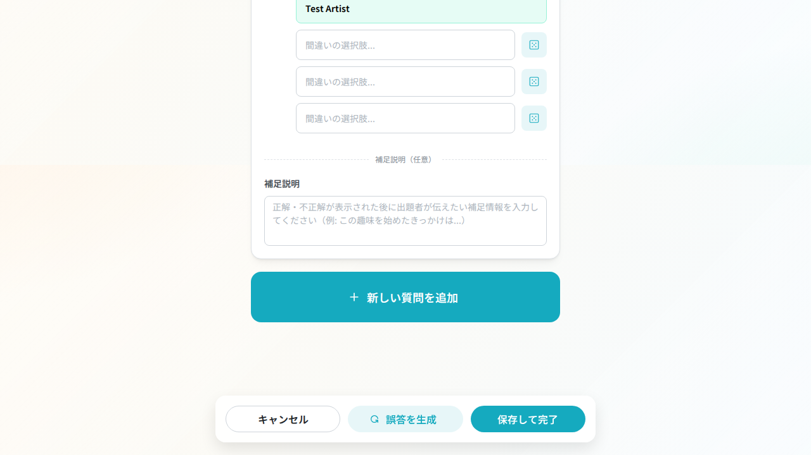
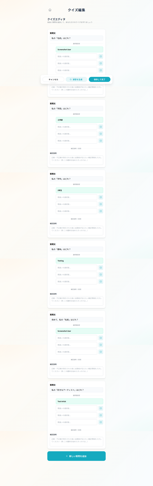

# クイズ編集画面ボタン移動・名称変更

## 概要

クイズ編集画面（`/events/:id/quiz/edit`）において、「固定項目を自動埋め」ボタンの位置と名称を変更しました。

## 変更内容

### 変更前

- **位置**: 画面上部のヘッダー行付近
- **名称**: 「固定項目を自動埋め」
- **問題点**:
  - スクロールすると画面外に消えてしまい認知しづらい
  - ボタン名が分かりにくい

### 変更後

- **位置**: 画面下部の固定Pill内（キャンセルと保存の間）
- **名称**: 「↺誤答を生成」
- **改善点**:
  - スクロールしても常に表示される固定Pillに配置
  - より直感的で分かりやすい名称
  - 関連アクション（キャンセル、保存）と同じ場所に配置

## ボタン配置順序

```
[キャンセル] [誤答を生成] [保存して完了]
```

## 実装詳細

### 変更ファイル

- `app/feat/quiz/screens/QuizEditScreen.tsx`
  - 画面上部のボタンを削除（lines 620-627）
  - 画面下部の固定Pillにボタンを追加（lines 681-688）

### 機能の保持

- ボタンの機能は変更なし（`fillAll`関数を呼び出し）
- すべての固定項目（名前、学部、学年、趣味、アーティスト）の誤答を自動生成

## テスト

### 新規追加テスト

- `e2e/test_quiz_edit_button_location.spec.ts`
  - ボタンが画面上部に存在しないことを確認
  - ボタンが画面下部の固定Pillに存在することを確認
  - ボタンの順序が正しいことを確認（キャンセル → 誤答を生成 → 保存）
  - ボタンの機能が正常に動作することを確認

### テスト結果

✅ すべてのテストが合格
✅ TypeScript型チェック: 問題なし
✅ コードレビュー: 問題なし  
✅ セキュリティチェック: 問題なし

## スクリーンショット

### 画面下部の固定Pill



キャンセル、誤答を生成、保存して完了の3つのボタンが正しく配置されています。

### 全画面表示



画面上部にボタンがなく、下部の固定Pillにのみボタンが配置されています。

## UX改善効果

1. **認知性の向上**: 固定Pillに配置することで、スクロールしても常にボタンが表示される
2. **操作性の向上**: 関連するアクション（キャンセル、保存）と同じ場所に配置
3. **理解しやすさの向上**: 「誤答を生成」という直感的な名称に変更
4. **一貫性の向上**: 他の画面でも下部に操作ボタンを配置するパターンと一致

## 技術的な考慮事項

- 最小限の変更で実装（surgical changes）
- 既存の機能に影響を与えない
- E2EテストでUIの動作を保証
- アクセシビリティを考慮した実装（ボタンの視認性向上）
